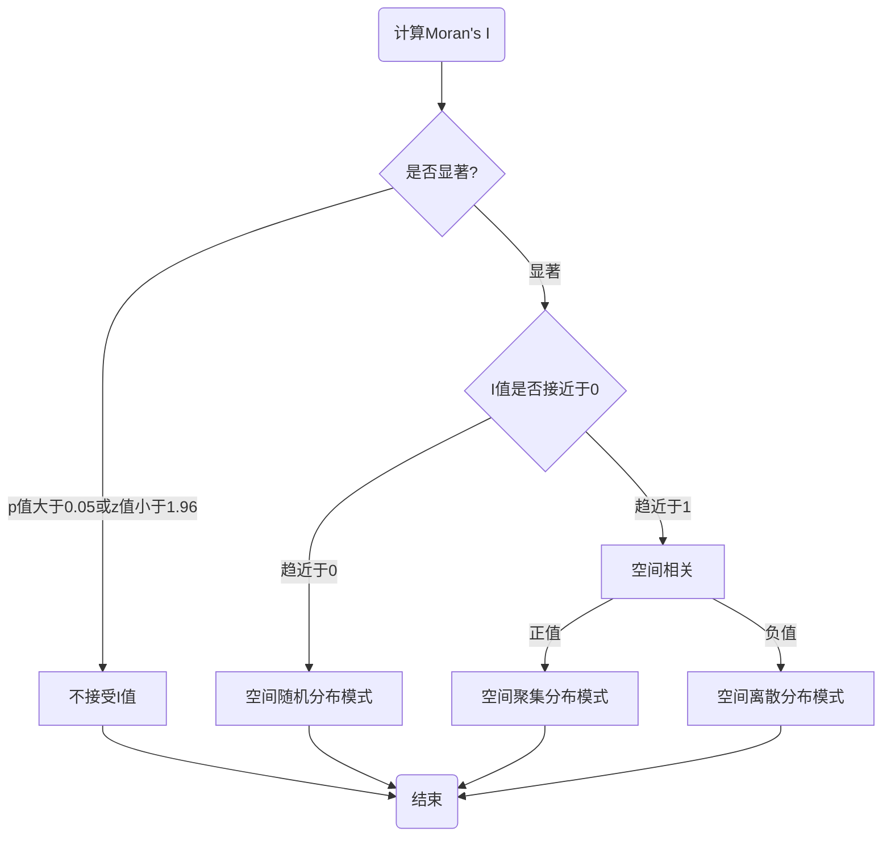

---

layout:     post
title:      " 莫兰指数 Moran's I  "
description:   " 莫兰指数 Moran's I "
date:       2021-04-12 10:00:00
author:     "西山晴雪"
mathjax:    true
categories: 
    - [GeoAI, 空间统计学工具]
tags:
    - GeoAI
    - 空间统计学工具
    - 莫兰指数
    - 空间自相关性
    - “Moran's I”
---

# 莫兰指数 （Moran's I）

**【评论】** 空间相关性是地理学第一定律的核心。从空间统计学角度，需要一种能够度量空间相关性的指标，以量化空间相关性的程度，因而莫兰指数（Moran’s I）就应运而生了。

**【原文】**https://godxia.blog.csdn.net/article/details/47130353	

**【注】** 可参考空间计量学、地理空间统计学等书籍，ArgGIS、GeoDa 、R、Python等提供相应统计工具。

# 1 引言

莫兰指数是用来度量空间相关性的一个重要指标。莫兰指数分为全局莫兰指数（Global Moran's I）和安瑟伦局部莫兰指数（Anselin Local Moran's I）后者是美国亚利桑那州立大学地理与规划学院院长Luc Anselin教授在1995年提出的。

# 2 全局莫兰指数

## 2.1 计算公式

在全局相关分析中，最常用的统计量就是 Global Moran’I (全局莫兰指数)，它主要是用来描述所有的空间单元在整个区域上与周边地区的**平均关联程度**。计算公式如下：
$$
I=\frac{n}{S_{0}} \times \frac{\sum_{i=1}^{n} \sum_{j=1}^{n} w_{i j}\left(y_{i}-\bar{y}\right)\left(y_{j}-\bar{y}\right)}{\sum_{i=1}^{n}\left(y_{i}-\bar{y}\right)^{2}}
$$
其中, $ S_{0}=\sum_{i=1}^{n} \sum_{j=1}^{n} w_{i j}$ 为总权重， $ w_{i j} $ 为第 $i$ 和第 $j$ 个空间单元间的空间权重值， $n$ 为空间单元总个数，  $ y_{i} $ 和 $ y_{j} $ 分别表示第 $i$ 个空间单元和第 $j$ 个空间单元的特征值（即样本点的某个属性值，如房产价格、GDP总量等，严格来说，莫兰指数是在判断某个属性的空间相关性）， $ \bar{y} $ 为所有空间单元特征值的均值。

## 2.2 对全局莫兰指数的理解

依据公式，莫兰指数 $I$ 的取值范围为 $[-1,1]$ ，有着明确的空间相关性含义。

| $I$ 值范围 | 含义 |
| :--------: | :--: |
| $ I > 0 $  |  所有地区的属性值在空间上有正相关性，即属性值越大(小)越容易聚集在一起    |
| $ I = 0 $  |  表示地区随机分布，无空间相关性    		|
| $ I < 0 $  |  所有地区的属性值在空间上有负相关性，即属性值越大(小)越不容易聚集在一起   |

那么为什么会有这样的空间相关性含义呢？

从整个计算过程可知，空间相关性主要体现在分子$ \sum_{i=1}^{n} \sum_{j=1}^{n} w_{i j}\left(y_{i}-\bar{y}\right)\left(y_{j}-\bar{y}\right) $ 中，其他项可以暂且简单地视为归一化项。 而该分子公式的实质就是：**空间单元的邻接权重指数** × **空间单元间属性值的偏差**。前者对应着**各地区在空间上的位置关系**，后者对应着**各地区属性值之间的差异**，两者作乘积，再求和，就得到了所有地区在整个空间上的相关性程度。直观上理解，对于邻近的点 $i,j$ ，只有当 $ y_{i}$  和 $y_{j}$ 同时**大于或者小于**均值 $\bar y$ 时（正相关），值越大，全局莫兰指数越趋近于 $+1$；而当 $y_{i}$ 和 $y_{j}$ 偏离平均值 $ \bar {y}$ 且方向相反时（负相关），偏离值越大时，全局莫兰指数越趋向于 $-1$。

## 2.3 简单的计算案例

以重庆市**江津区**、**巴南区**、**南川区**、**綦江区**为例，具体邻接情况如下图所示：  

  

**（1）首先计算空间权重矩阵**

此处直接采用邻接矩阵，则有 $W$  如下：

  

**（2）计算特征值及其统计量**

四个区县的特征值 $F$ 依次为 10, 20, 30, 40， 分别对应 $ y_{1}, y_{2}, y_{3}, y_{4}$，  则 $ \bar{y}=25$，分母 $ \sum_{i=1}^{4}\left(y_{i}-\bar{y}\right)^{2}=500 $

**（3）计算全局莫兰指数**

根据公式， $ S_{0}=\sum_{i=1}^{n} \sum_{j=1}^{n} w_{i j} $， 此时 $ n=4 $， $ S_{0} $ 为空间权重矩阵中所有元素的和 ，等于10；分子  $ \sum_{i=1}^{4} \sum_{j=1}^{4} w_{i j}\left(y_{i}-\bar{y}\right)\left(y_{j}-\bar{y}\right)= -350$ 。则 Global Moran’I 的值为：  

$$
I=\frac{4}{10} \times \frac{-350}{500}=-0.28
$$

**（4） 对零指数的解释**

如果基于该指数的计算值，说明重庆四个区县的特征 $F$ ，在空间上存在较弱的负相关特性，即距离越近，特征 $F$ 越不相似。究其原因，是因为特征值为人造数值，并不能真实反应空间相关特性。

## 2.4 全局莫兰指数的分析

空间分布模式通常指的是带有位置属性的数据在一定的空间范围内的分布规律，而莫兰指数则是一个评估属性数据在空间上自相关性规律的指标。下图为空间分布模式的分解图，全局莫兰指数的重要作用，是给属性数据的空间分布模式以量化的指标。

我们联系一下实际情况来深入理解全局莫兰指数。一个教室有很多个座位，一个座位对应一名学生的成绩。 $ y_{i}$ 代表 第 $i$ 个座位学生的成绩，  $ y_{j}$ 代表 第 $j$ 个座位学生的成绩。

从**聚集**的角度来看分布模式与莫兰指数：

1. **聚集分布模式（正相关）：**当 $ y_{i} $ 和 $ y_{j} $ 都大(小)于 $ \bar{y} $ 时, 即 $ i $ 座位和 $ j $ 座位的学生成绩都是要高(低)于整个班的平均成绩的，此时如果 $ i $ 座位与 $ j $ 座位相邻，即计算出莫兰指数一定是大于0的。换个方式来说，当莫兰指数大于 0 时，表示成绩越高(低)的学生越容易聚集在一起，聚集性强。(类比：学霸总和学霸玩, 学渣总和学渣玩，此时成绩在空间上呈正相关性)。
2. **离散分布模式（负相关）：**当 $ y_{i} $ 和 $ y_{j} $ 其中有一个小于平均水平 $ \bar{y} $ 时，此时如果 $ i $ 座位与 $ j $ 座位相邻，即计算出莫兰指数一定是小于0的。换个方式, 当莫兰指数 小于0时，表示成绩越高(低)越不容易聚集在一起，即差异（离散）性强。(类比：有些学霸特别喜欢和学渣一起玩，此时成绩在空间上呈现负相关性)。
3. **随机分布模式（不相关）：**当班上既有学霸和学霸一起玩的现象，又有学霸和学渣一起玩的现象时，那么在计算莫兰指数的时候, 可能两两抵消, 最终莫兰指数接近 0， 那么在整个空间上就表现为不相关性，即随机性强。但全局不相关不意味着不存在局部的聚集（局部相关），所以还需要指标来量化局部的聚集。

从**差异**的角度来看分布模式与莫兰指数： 

1. **聚集分布模式（正相关）：**当学霸们和学霸们、学渣们和学渣们都聚集在一起时，那么此时莫兰指数大于0，成绩差异就会非常小。这也解释了为什么当莫兰指数越大时，空间差异就小（可能意味着你知道某个点的值，就大概率可以推算出它周边点的值就在附近，因为他们空间差异比较小）。
2. **离散分布模式（负相关）：**反之，当学霸们和学渣们混合在一块时，莫兰指数小于0，则莫兰指数越小，空间差异就越大（可能意味着你知道了某个点的值，就大概率可以预测周边点的值远离该点的值，因为他们空间差异太大）。
3. **随机分布模式（不相关）：**当班上既有学霸和学霸一起玩的现象，又有学霸和学渣一起玩的现象时，莫兰指数趋近于0（可能意味着你知道了某3个点的值，也无法知道周边点的值，因为他们之间压根儿没有相关性）。

## 2.5 Moran’I 指数的检验

 统计学的假设检验就是提出一个假设，然后通过计算和分析某些统计量的分布来判断假设是否成立。如果不成立就拒绝这个假设，如果成立则接受这个假设。

对于莫兰指数的检验，原假设 $H_0$ 为：**不存在空间自相关或者空间完全随机分布（CSR假设），即 $E（I）=0$**，则按照假设检验方法，当区域个数 $ n $ 足够大时，全局莫兰指数近似服从正态分布， 因此可得 $\mathbf{Z}$ 检验值：

$$
Z=\frac{I-E(I)}{\sqrt{\operatorname{var}(I)}}
$$
其均值和方差的计算方法如下所示：
$$
\begin{equation}
\begin{aligned}
E(I)&=-\frac{1}{n-1}\\\\
\operatorname{Var}(I)&=\frac{n^{2}(n-1) \frac{1}{2} \sum_{i \neq j}\left(w_{i j}+w_{j i}\right)^{2}-n(n-1) \sum_{k}\left(\sum_{j} w_{k j}+\sum_{i} w_{i k}\right)^{2}-2\left(\sum_{i \neq j} w_{i j}\right)^{2}}{(n+1)(n-1)^{2}\left(\sum_{i \neq j} w_{i j}\right)^{2}}
\end{aligned}
\end{equation}
$$

在显著性为0.05水平下，只要满足 $ ∣ Z ∣ > 1.96$，或者 $P$ 值小于显著性水平0.05，即可拒绝原假设 $ H_0$，有充分理由认为莫兰指数显著。

## 2.6 指数检验案例

以2018年重庆市各区的GDP数据为例，通过R软件计算得出如下全局莫兰指数统计数据：

  

其中： $Moran’I =0.557$ ，$P$ 值为 $2.043\times10^{-9}$ ，远远小于显著性水平0.05，则拒绝**“所有研究对象在空间上呈随机分布”**的原假设，有充分理由认为莫兰指数显著有效。而且**2018年重庆市各区县经济发展水平在空间上呈正相关性，即经济水平越高(低)的地区越容易发生聚集效应。**

下图为某地区犯罪率与空间的关系，根据统计数据，$Moran's \quad I=0.1872$，表明具有犯罪率这个特征具有空间相关性，而 $ Z =14.6688$ 则表明可以接受莫兰指数显著有效，且由于 $Z$ 值为正且远大于1倍标准差，让我们有理由相信，当地的犯罪率在空间上呈现聚集分布模式。

# 3 其他空间自相关指数

## 3.1 Local Moran's I 局部莫兰指数

正如2.2节所述，全局莫兰指数接近0时，表明特征值存在全局空间不相关的现象，但并不能避免局部相关的可能性。因此，安瑟伦提出了局部莫兰指数（Anselin Local Moran's I）。

 局部莫兰指数的定义

如果想知道某个区域 $i$ 附近的空间相关情况（是否相关？是正相关还是负相关？）
$$
I_{i}=\frac{\left(x_{i}-\bar{x}\right)}{S^{2}} \sum_{j=1}^{n} w_{i j}\left(x_{j}-\bar{x}\right)
$$
局部莫兰指数 $ I $ 的含义与全局莫兰指数 I 相似。

## 3.2 Geary's C 吉尔里指数

需要指出的是，莫兰指数 $I$ 并非唯一的空间自相关指标，另一常用指标为“吉尔里指数 C”( Geary's C），也称为“吉尔里相邻比率”。其计算式为：
$$
C=\frac{(n-1) \sum_{i=1}^{n} \sum_{j=1}^{n} w_{i j}\left(x_{i}-x_{j}\right)^{2}}{2\left(\sum_{i=1}^{n} \sum_{j=1}^{n} w_{i j}\right)\left[\sum_{i=1}^{n}\left(x_{i}-\bar{x}\right)^{2}\right]}
$$
吉尔里指数 $ C $ 的核心成分为 $ \left(x_{i}-x_{j}\right)^{2} $ 。

吉尔里指数 $ C $ 的取值一般介于 0 到 2 之间 不（ 2 不是严格上界），再对指数的分析上，吉尔里指数 $C$ 大 于 1 表示负相关，等于 1 表示不相关，而小于 1 表示正相关。

吉尔里指数 $ C $ 与莫兰指数 $ I $ 呈反向变动；前者比后者对于局部空间自相关更为敏感。

在不存在空间自相关的原假设下，吉尔里指数 $ C $ 的期望值为 1, 而方差的表达式较复杂，记为 $ \operatorname{Var}(C) $ 。
标准化的吉尔里指数 $ C $ 服从渐近标准正态分布。与莫兰指数 $I$ 的检验类似，可以通过 $Z$ 值和 $p$ 值来对结果的显著性水平进行评价，以决定是否接收吉尔里指数 $C$ 。
$$
C^{*} \equiv \frac{C-1}{\sqrt{\operatorname{Var}(C)}} \stackrel{d}{\longrightarrow} N(0,1)
$$

## 3.3 Getis-Ord'G 指数G

莫兰指数 I 与吉尔里指数 C 的共同缺点在于，即无法分别“热点”(hot spot)与“冷点”(cold spot)区域。 所谓热点区域，即高值与高值聚集的区域；而冷点区域则是低值与低值聚集的区域。热点区域与冷点区域都表现为正自相关。

Getis and Ord (1992)提出了以下“Getis-Ord 指数 $ G $ ":
$$
G=\frac{\sum_{i=1}^{n} \sum_{j=1}^{n} w_{i j} x_{i} x_{j}}{\sum_{i=1}^{n} \sum_{j \neq i}^{n} x_{i} x_{j}}
$$
其中， $ x_{i}>0, \forall i ; $ 而 $ w_{i j} $ 来自非标准化的对称空间权重矩阵，且 所有元素均为 0 或 1 。

如果样本中高值聚集在一起，则 G 较大；如果低值聚集在一起，则 G 较小。

在无空间自相关的原假设下， $ \mathrm{E}(G)=\frac{\sum_{i=1}^{n} \sum_{j \neq i}^{n} w_{i j}}{n(n-1)} $ 。如果 G 值大于此期望值，则表示存在热点区域； 如果 G 值小于此期望值，则表示存在冷点区域。 标准化的 G 服从渐近标准正态分布：

$$
G^{*} \equiv \frac{G-\mathrm{E}(G)}{\sqrt{\operatorname{Var}(G)}} \stackrel{d}{\longrightarrow} N(0,1)
$$

如果 $G^*>1.96$ ，则可在 5%水平上拒绝无空间自相关的原假设，认为存在空间正自相关，且存在热点区域。 

如果 $ G^{*}<-1.96 $, 则可在 $ 5 \% $ 水平上拒绝无空间自相关的原假设， 认为存在空间正自相关，且存在冷点区域。

如果要考察某区域 $ i $ 是否为热点或冷点，则可使用“局部 Getis-Ord 指数 $ G $ "
$$
G_{i}=\frac{\sum_{j \neq i} w_{i j} x_{j}}{\sum_{j \neq i} x_{j}}
$$

## 3.4 Q-statics

# 4 小结

Moran'I 、Geary's C、Getis-Ord's G等空间自相关指数对于我们判断空间点（或面元）的某些特征（属性）值，是否具有空间自相关性以及其空间分布特征非常有帮助。下图以Moran's I为例，给出了上述指数“指数计算-->显著性分析-->自相关性分析-->分布模式分析”的常用分析流程。

# 5 补充资料

本文术语点模式分析的范畴：

（1）空间点模式

空间点模式是由某个随机过程生成的一组位置，这些位置分布在选定区域内。例如：雷击、地震震中、松树的位置等。这些位置被称为事件，而这组事件构成一个点过程。

（2）数学定义

考虑点过程：$ Z(S) \quad S∈D,\quad D ⊂\mathbb{R}^{\{1,2,or 3 \}} $ ，该过程的实现由 $D$ 中点的图案(排列)组成。这些点被称为点过程的事件。

（3）CSR假设

如果以下条件成立，则点模式称为完全随机模式（CSR），点模式分析基于完全空间随机性假设：

- 事件的平均数量（强度，$λ(S)$ ）在整个D中是均匀的；
- 在两个不重叠的子区域 $A_1$ 和 $A_2$ 中事件的数量是独立的;
- 任何子区域内事件的数量都服从泊松分布。

（4）通过对CSR假设的显著性检验来判断是否存在空间模式

亦即对点模式数据的分析始于对CSR假设的检验。如果特定模式不排斥CSR，则通常不需要进一步统计分析。如果CSR被拒绝，那么需要进一步调查来解释空间点模式的性质。

假设的显著性检验方式主要有三种：

（1）基于密度的检验方法

- 基于样方的检验方法（与随机方法做比较）

样方空间不连续：样方分析-->样方选择-->频率分布统计--> $\mathcal{X}^2$ 检验

样方空间连续：计算I指数、C指数以及Z值或p值确定显著性

- 核密度估计方法（在核密度图上峰值）

选择核密度函数-->核密度估计-->核密度聚类

（2）基于距离的检验方法

- 最近邻距离计算-->最近邻指数计算-->Z值检验

（3）基于仿真的检验方法

- 蒙特卡洛方法
- 仿真包络方法