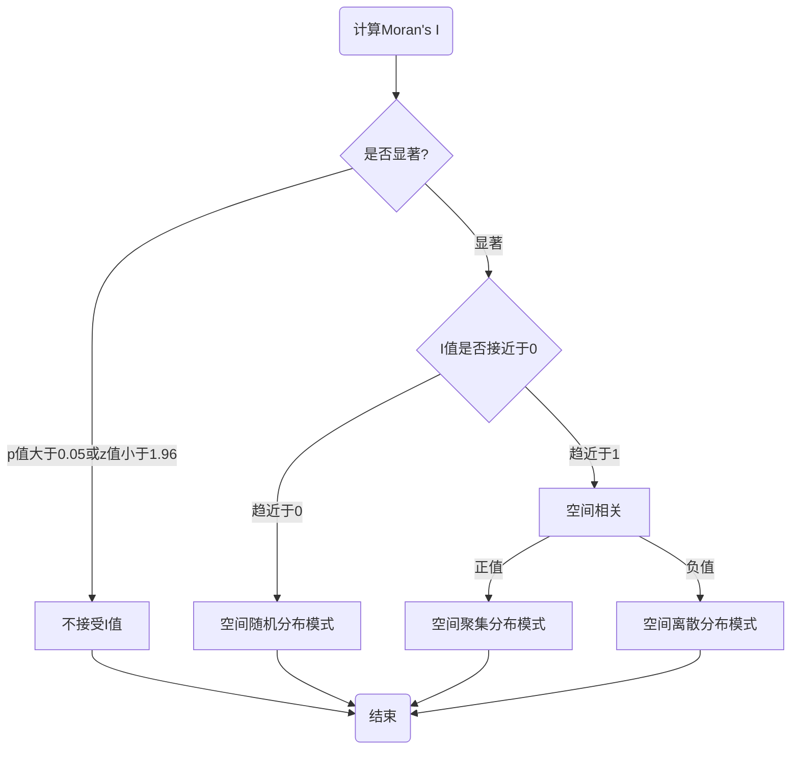

---

layout:     post
title:      " 空间聚集时的冷热点分析 -- Getis-Ord's G指数  "
description:   " 空间聚集时的冷热点分析 -- Getis-Ord's G指数 "
date:       2021-04-19 10:00:00
author:     "西山晴雪"
mathjax:    true
categories: 
    - [GeoAI, 空间统计学工具]
tags:
    - GeoAI
    - 空间统计学工具 
    - 空间自相关性
    - "Ripley's K"
---

# 距离对空间模式的影响度量-- Ripley's K 函数

**【评论】** 空间相关性是地理学第一定律的核心。从空间统计学角度，需要一种能够度量空间相关性的指标，以量化空间相关性的程度，因而莫兰指数（Moran’s I）就应运而生了。

**【原文】**https://godxia.blog.csdn.net/article/details/47130353	

**【注】** 可参考空间计量学、地理空间统计学等书籍，ArgGIS、GeoDa 、R、Python等提供相应统计工具。

# 1 问题的提出

莫兰指数 I 与吉尔里指数 C 的共同缺点在于，无法分别“热点”(hot spot)与“冷点”(cold spot)区域。 所谓热点区域，即高值与高值聚集的区域；而冷点区域则是低值与低值聚集的区域。在莫兰指数和吉尔里指数中，热点区域与冷点区域都表现为正自相关。

Getis and Ord (1992)提出了以下“Getis-Ord 指数 $ G $ ":
$$
G=\frac{\sum_{i=1}^{n} \sum_{j=1}^{n} w_{i j} x_{i} x_{j}}{\sum_{i=1}^{n} \sum_{j \neq i}^{n} x_{i} x_{j}}
$$
其中， $ x_{i}>0, \forall i ; $ 而 $ w_{i j} $ 来自非标准化的对称空间权重矩阵，且 所有元素均为 0 或 1 。

如果样本中高值聚集在一起，则 G 较大；如果低值聚集在一起，则 G 较小。

在无空间自相关的原假设下， $ \mathrm{E}(G)=\frac{\sum_{i=1}^{n} \sum_{j \neq i}^{n} w_{i j}}{n(n-1)} $ 。如果 G 值大于此期望值，则表示存在热点区域； 如果 G 值小于此期望值，则表示存在冷点区域。 标准化的 G 服从渐近标准正态分布：

$$
G^{*} \equiv \frac{G-\mathrm{E}(G)}{\sqrt{\operatorname{Var}(G)}} \stackrel{d}{\longrightarrow} N(0,1)
$$

如果 $G^*>1.96$ ，则可在 5%水平上拒绝无空间自相关的原假设，认为存在空间正自相关，且存在热点区域。 

如果 $ G^{*}<-1.96 $, 则可在 $ 5 \% $ 水平上拒绝无空间自相关的原假设， 认为存在空间正自相关，且存在冷点区域。

如果要考察某区域 $ i $ 是否为热点或冷点，则可使用“局部 Getis-Ord 指数 $ G $ "
$$
G_{i}=\frac{\sum_{j \neq i} w_{i j} x_{j}}{\sum_{j \neq i} x_{j}}
$$

# 5 小结

Moran'I 、Geary's C、Getis-Ord's G等空间自相关指数对于我们判断空间点（或面元）的某些特征（属性）值，是否具有空间自相关性以及其空间分布特征非常有帮助。下图以Moran's I为例，给出了上述指数“指数计算-->显著性分析-->自相关性分析-->分布模式分析”的常用分析流程。

